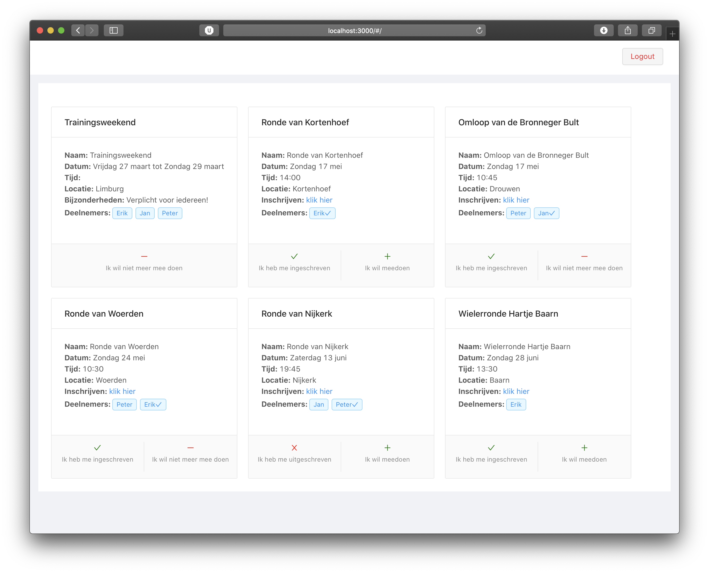
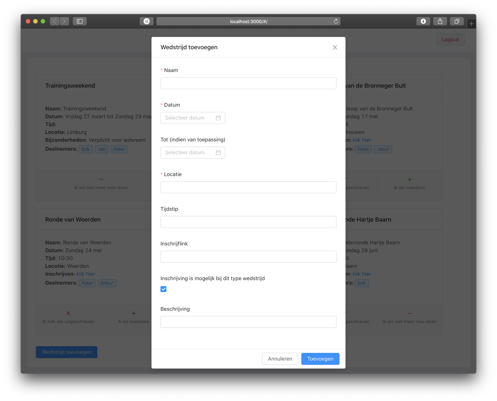

## Race Calendar
Race calendar is a simple responsive SPA that I created to manage the race attendance of the members of my cycle team. Fellow team members can create an account using a private token and then check which races are selected by the team's sports director. Members can then show their interest in the race and whether they have registered. 

Note: text visible in the UI is in Dutch but the code is in English.


Screenshot of the main application window


When adding a new race (admin only)


### Requirements
```
nodejs
mongodb
```

### Installation
#### Frontend
```
cd frontend
npm install
npm start
```

#### Backend
Make sure MongoDB is running first
```
cd backend
npm install
node app.js
```